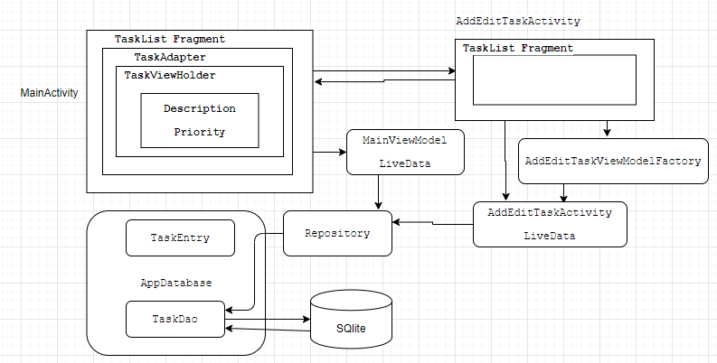
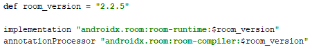
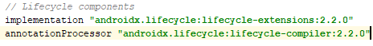
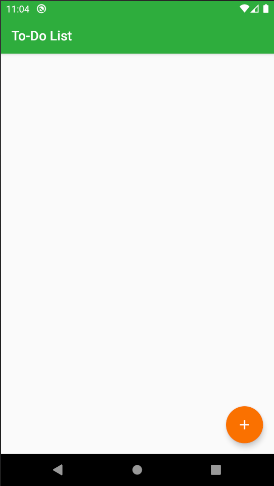
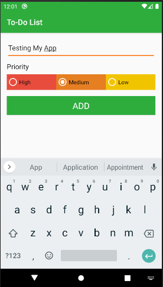
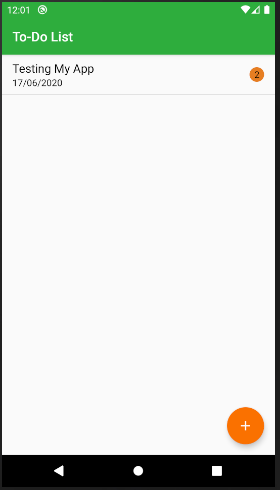
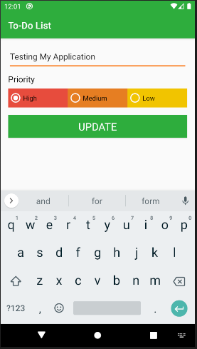
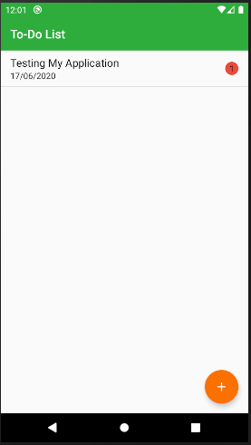
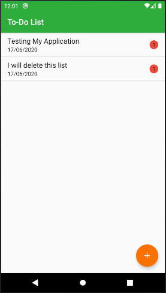
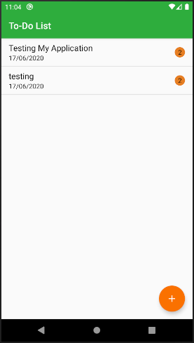

# Android ToDo Application 
Android TODO is a simple app that can add new todo list, update it and delete unwanted data form the list.

# Architecture Used 
MVVM (Model–view–viewmodel) architecture is used for developing android todo app. 

# Library Used 
Lifecycle & Room Persistence Library are used.
>
>

# TODO fragment 
TaskList fragment is the home page of todo app. Here user can view all todo list and perform following task. 

## Add Task with Custom toast
User is able to add new task after clicking floating action button on TaskList fragment. On clicking Add button list is added and custome toast message is displayed. 
-

## Update TODO list
On clicking any list in TaskList fragment user is able to update current data.

## Delete unwanted list ##
Unwanted data is removed by right or left swipe. 
>

